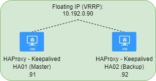

# HA cluster


## Index  
  * [Configuration files](#configuration-files)
  * [Prerequisites](#prerequisites)
  * [Keepalived Setup](#keepalived-setup)
  * [HAProxy Setup](#haproxy-setup)
  * [References](#references)

### Configuration files

<table>
  <tr>
    <td>HA Config</td>
    <td>HA01</td>
    <td>HA02</td>
  </tr>
  <tr>
    <td>Keepalived</td>
    <td><a href="../keepalived/master_keepalived.conf">Master</a></td>
    <td><a href="../keepalived/backup_keepalived.conf">Backup</a></td>
  </tr>  
  <tr>
    <td>HAProxy</td>
    <td colspan="2" align="center"><a href="../HAProxy/haproxy.cfg">Config</a></td>
  </tr>
</table>

### Prerequisites
* Minimum two Ubuntu 18.04 servers
* Hostname
* Static IP

#### Set hostname 
```
hostnamectl set-hostname HA01
```
Reboot is required after changing the hostname.

#### Set static IP
`sudo nano /etc/netplan/50-cloud-init.yaml`

```yaml
network:
    ethernets:
        ens160:
            dhcp4: false
            addresses: [10.192.0.91/24,10.192.0.90/24] # Second IP is the fail-over IP
            gateway4: 10.192.0.1
            nameservers:
              addresses: [10.192.0.11,10.192.0.12]
    version: 2
```

Apply the settings: `sudo netplan apply`

### Keepalived Setup

Install Keepalived:

```
sudo apt-get update
sudo apt-get install linux-headers-$(uname -r) -y
sudo apt-get install keepalived -y
```

Edit `/etc/keepalived/keepalived.conf`. Example of a config for both Master and Backup can be found at the ['Configuration files'](#configuration-files) section at the top

```
vrrp_instance VI_1 {
    interface ens160
    state MASTER
    priority 200

    virtual_router_id 33
    unicast_src_ip 10.192.0.91
    unicast_peer {
        10.192.0.92
    }

    authentication {
        auth_type PASS
        auth_pass password
    }
    virtual_ipaddress {
        10.192.0.90
    }
}
```
Verify installation and service status `systemctl status keepalived.service`

Experience from installing:
Split-brain occurred right after a fresh install. Rebooting fixed this problem. Don't ask how...

### HAProxy Setup
Install HAProxy:
```
sudo apt-get update
sudo apt-get install haproxy -y
```

Add following to `/etc/sysctl.conf`:
```
Net.ipv4.ip_nonlocal_bind=1
```

Apply settings: `sysctl -p`

Now configure your front- and backends in <a href="../HAProxy/haproxy.cfg">`/etc/haproxy/haproxy.cfg`</a>:

```cfg
#--^After default configuration^--# 
frontend stats
    bind 10.192.0.90:8404
    stats enable
    stats uri /stats
    stats refresh 10s
    stats admin if LOCALHOST

frontend www.example.com
    bind 10.192.0.90:80
    bind 10.192.0.90:443
    bind 10.192.0.90:8080
    option tcplog
    mode tcp
    default_backend docker_swarm

backend docker_swarm
    mode tcp
    balance leastconn
#    balance roundrobin
    option ssl-hello-chk
    server docker01 10.192.0.41 check port 80
    server docker02 10.192.0.42 check port 80
    server docker03 10.192.0.43 check port 80
    server docker04 10.192.0.44 check port 80
```


Check if configuration file is valid: `haproxy -c -V -f /etc/haproxy/haproxy.cfg`  
Reload the service: `sudo service haproxy restart`  
Check status: `service haproxy status`  
Stats page can be accessed at http://10.192.0.90:8404/stats


-------------------------
### References
#### Keepalived
[How to Setup IP Failover with KeepAlived on Ubuntu & Debian](https://tecadmin.net/setup-ip-failover-on-ubuntu-with-keepalived/)  
[How To Set Up Highly Available HAProxy Servers with Keepalived and Floating IPs on Ubuntu 14.04](https://www.digitalocean.com/community/tutorials/how-to-set-up-highly-available-haproxy-servers-with-keepalived-and-floating-ips-on-ubuntu-14-04)  

#### HAProxy
[Setup HAProxy 2 with KeepAliveD and Layer 7 Retries](https://www.ssltrust.com.au/help/setup-guides/haproxy2-layer7-retries-keepalived)  
[How To Set Up Highly Available HAProxy Servers with Keepalived and Floating IPs on Ubuntu 14.04](https://www.digitalocean.com/community/tutorials/how-to-set-up-highly-available-haproxy-servers-with-keepalived-and-floating-ips-on-ubuntu-14-04)  
[Haproxy - frontend vs backend ports](https://nordisch.org/posts/haproxy-frontend-vs-backend-ports/)  
[Using SSL Certificates with HAProxy](https://serversforhackers.com/c/using-ssl-certificates-with-haproxy)  
