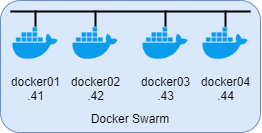

# Docker Swarm


## Index  
  * [Configuration files](#configuration-files)
  * [Prerequisites](#prerequisites)
  * [Docker install](#docker-install)
  * [References](#references)

### Configuration files

<table>
  <tr>
    <td>Docker Swarm</td>
    <td>DockerXX</td>
  </tr>
  <tr>
    <td>Docker + compose install script</td>
    <td><a href="../docker/install_docker.sh">install_docker.sh</a></td>
  </tr>  
</table>

### Prerequisites
* Minimum two (four in this example) Ubuntu 18.04 servers
* Hostname
* Static IP
* Firewall

#### Set hostname 
```
sudo sed -i 's/.*/Docker01/' /etc/hostname
```
Reboot is required after changing the hostname.

#### Set static IP
`sudo nano /etc/netplan/50-cloud-init.yaml`

```yaml
network:
    ethernets:
        ens160:
            dhcp4: false
            addresses: [10.192.0.41/24]
            gateway4: 10.192.0.1
            nameservers:
              addresses: [10.192.0.11,10.192.0.12]
    version: 2
```

Apply the settings: `sudo netplan apply`

#### Firewall

```
ufw allow 22/tcp
ufw allow 2376/tcp
ufw allow 2377/tcp
ufw allow 7946/tcp
ufw allow 7946/udp
ufw allow 4789/udp
```

Reload UFW: `ufw reload`

### Docker install

To install Docker + Docker Compose, run the script <a href="../docker/install_docker.sh">install_docker.sh</a>. Customize for your own needs. It will as default create a user for docker called `dockeradmin` with the password `supersecret`


Add the hosts that are part of the swarm, to the hostfile on all hosts:
```
sudo sed -i '$a 10.192.0.41 docker01' /etc/hosts
sudo sed -i '$a 10.192.0.42 docker02' /etc/hosts
sudo sed -i '$a 10.192.0.43 docker03' /etc/hosts
sudo sed -i '$a 10.192.0.44 docker04' /etc/hosts
```

Initialise the swarm manager:
```
# 10.192.0.41 is the manager IP
docker swarm init --advertise-addr 10.192.0.41
```

Join workers to swarm. Running the command above will output a similar string. This has to be executed on all the workers (hosts) except the manager to join the swarm as workers:
```
docker swarm join --token SWMTKN-1-4v8iluwnmjmcsom67dlavri4nujzfz83xswo9laa5bn8owodrd-e0iqso1q3xtggbu2y3126f1sz 10.192.0.41:2377
```

Verify the swarm:
```
docker node ls
```


-------------------------
### References
#### Docker Swarm
[How to Configure Docker Swarm with multiple Docker Nodes on Ubuntu 18.04](https://linuxconfig.org/how-to-configure-docker-swarm-with-multiple-docker-nodes-on-ubuntu-18-04)  
[Installing docker and docker compose on ubuntu 18.04 / 16.04](https://medium.com/@techgeek628/installing-docker-and-docker-compose-on-ubuntu-18-04-16-04-a38179502d9b)  
