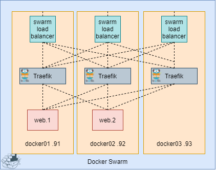

# Traefik



## Index  
  * [Configuration files](#configuration-files)
  * [Folder structure](#folder-structure)  
  * [Prerequisites](#prerequisites)
  * [Traefik](#traefik)
    * [Self-signed certificate](#self-signed-cert)
    * [Deploying Traefik](#deploying-traefik)
  * [Whoami](#whoami)
  * [References](#references)

### Configuration files

<table>
  <tr>
    <td>Docker Swarm</td>
    <td colspan="2" align="center">DockerXX</td>
  </tr>
  <tr>
    <td>Traefik</td>
    <td colspan="2" align="center"><a href="../docker/traefik.yml">traefik.yml</a></td>
  </tr>  
  <tr>
    <td>Self-signed certificate</td>
    <td><a href="../docker/mkcerts.sh">mkcerts.sh</a></td>
    <td><a href="../docker/config/certs.toml">certs.toml</a></td>
  </tr>  
  <tr>
    <td>Whoami</td>
    <td colspan="2" align="center"><a href="../docker/whoami.yml">whoami.yml</a></td>
  </tr>  
</table>

### Folder structure
```
docker
│   mkcerts.sh    
│   traefik.yml    
│   whoami.yml    
└───certs
│   │   cert.crt
│   │   privkey.key
└───config
    │   certs.toml
```


### Prerequisites
* [Docker Swarm](./swarm.md)

### Traefik

#### Self-signed certificate

To generate a self-signed certificate run <a href="../docker/mkcerts.sh">mkcerts.sh</a>. It will guide you through the process, and place the certificate in a folder called `./certs`.

Next up copy the Traefik configuration file <a href="../docker/config/certs.toml">certs.toml</a> to `./config`

#### Deploying Traefik

To start Traefik run the following

```
docker stack deploy traefik -c traefik.yml
```
After deploying the Traefik dashboard can be found at http://SWARMIP:8080


### Whoami

Example of an app using Traefik with HTTPS redirect:  
`docker stack deploy whoami -c whoami.yml`  
```YAML
version: '3'
services:
  whoami:
    image: containous/whoami:v1.3.0
    networks:
     - traefik_outside-world
    deploy:
      labels:
        - traefik.enable=true
        - traefik.http.middlewares.whoami-redirect-websecure.redirectscheme.scheme=https
        - traefik.http.routers.whoami-web.middlewares=whoami-redirect-websecure
        - traefik.http.routers.whoami-web.rule=Host(`whoami.example.com`)
        - traefik.http.routers.whoami-web.entrypoints=web
        - traefik.http.routers.whoami-websecure.rule=Host(`whoami.example.com`)
        - traefik.http.routers.whoami-websecure.tls=true
        - traefik.http.routers.whoami-websecure.entrypoints=websecure
        - traefik.http.services.whoami-websecure.loadbalancer.server.port=80
      replicas: 5

networks:
  traefik_outside-world:
    external: true
  traefik_internal-network:
    external: true
  default:
    external:
      name: traefik_internal-network
```


-------------------------
### References
#### Traefik
Credit to [@salderma](https://github.com/salderma/) for providing a [configuration example](https://github.com/salderma/traefik-concept) to configure self-signed certificate with Traefik.  

[Redirect HTTP to HTTPS](https://stackoverflow.com/questions/58666711/traefik-v2-404-while-routing-http-traffic-globally-to-https)  
